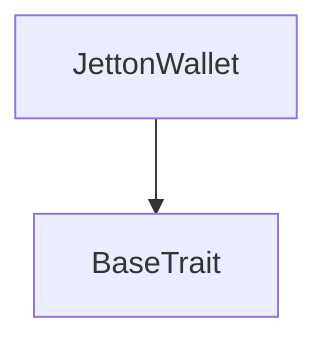
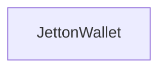

# Tact compilation report

Contract: JettonWallet
BoC Size: 1366 bytes

## Structures (Structs and Messages)

Total structures: 26

### DataSize

TL-B: `_ cells:int257 bits:int257 refs:int257 = DataSize`
Signature: `DataSize{cells:int257,bits:int257,refs:int257}`

### SignedBundle

TL-B: `_ signature:fixed_bytes64 signedData:remainder<slice> = SignedBundle`
Signature: `SignedBundle{signature:fixed_bytes64,signedData:remainder<slice>}`

### StateInit

TL-B: `_ code:^cell data:^cell = StateInit`
Signature: `StateInit{code:^cell,data:^cell}`

### Context

TL-B: `_ bounceable:bool sender:address value:int257 raw:^slice = Context`
Signature: `Context{bounceable:bool,sender:address,value:int257,raw:^slice}`

### SendParameters

TL-B: `_ mode:int257 body:Maybe ^cell code:Maybe ^cell data:Maybe ^cell value:int257 to:address bounce:bool = SendParameters`
Signature: `SendParameters{mode:int257,body:Maybe ^cell,code:Maybe ^cell,data:Maybe ^cell,value:int257,to:address,bounce:bool}`

### MessageParameters

TL-B: `_ mode:int257 body:Maybe ^cell value:int257 to:address bounce:bool = MessageParameters`
Signature: `MessageParameters{mode:int257,body:Maybe ^cell,value:int257,to:address,bounce:bool}`

### DeployParameters

TL-B: `_ mode:int257 body:Maybe ^cell value:int257 bounce:bool init:StateInit{code:^cell,data:^cell} = DeployParameters`
Signature: `DeployParameters{mode:int257,body:Maybe ^cell,value:int257,bounce:bool,init:StateInit{code:^cell,data:^cell}}`

### StdAddress

TL-B: `_ workchain:int8 address:uint256 = StdAddress`
Signature: `StdAddress{workchain:int8,address:uint256}`

### VarAddress

TL-B: `_ workchain:int32 address:^slice = VarAddress`
Signature: `VarAddress{workchain:int32,address:^slice}`

### BasechainAddress

TL-B: `_ hash:Maybe int257 = BasechainAddress`
Signature: `BasechainAddress{hash:Maybe int257}`

### JettonWallet$Data

TL-B: `_ balance:coins owner:address master:address = JettonWallet`
Signature: `JettonWallet{balance:coins,owner:address,master:address}`

### ChangeOwner

TL-B: `change_owner#819dbe99 queryId:uint64 newOwner:address = ChangeOwner`
Signature: `ChangeOwner{queryId:uint64,newOwner:address}`

### ChangeOwnerOk

TL-B: `change_owner_ok#327b2b4a queryId:uint64 newOwner:address = ChangeOwnerOk`
Signature: `ChangeOwnerOk{queryId:uint64,newOwner:address}`

### JettonData

TL-B: `_ total_supply:int257 mintable:bool owner:address content:^cell wallet_code:^cell = JettonData`
Signature: `JettonData{total_supply:int257,mintable:bool,owner:address,content:^cell,wallet_code:^cell}`

### JettonWalletData

TL-B: `_ balance:int257 owner:address master:address code:^cell = JettonWalletData`
Signature: `JettonWalletData{balance:int257,owner:address,master:address,code:^cell}`

### TokenTransfer

TL-B: `token_transfer#0f8a7ea5 query_id:uint64 amount:coins receiver:address response_destination:address custom_payload:Maybe ^cell forward_ton_amount:coins forward_payload:remainder<slice> = TokenTransfer`
Signature: `TokenTransfer{query_id:uint64,amount:coins,receiver:address,response_destination:address,custom_payload:Maybe ^cell,forward_ton_amount:coins,forward_payload:remainder<slice>}`

### TokenTransferInternal

TL-B: `token_transfer_internal#178d4519 query_id:uint64 amount:coins from:address response_destination:address forward_ton_amount:coins forward_payload:remainder<slice> = TokenTransferInternal`
Signature: `TokenTransferInternal{query_id:uint64,amount:coins,from:address,response_destination:address,forward_ton_amount:coins,forward_payload:remainder<slice>}`

### TokenNotification

TL-B: `token_notification#7362d09c query_id:uint64 amount:coins from:address forward_payload:remainder<slice> = TokenNotification`
Signature: `TokenNotification{query_id:uint64,amount:coins,from:address,forward_payload:remainder<slice>}`

### TokenBurn

TL-B: `token_burn#595f07bc query_id:uint64 amount:coins response_destination:address custom_payload:Maybe ^cell = TokenBurn`
Signature: `TokenBurn{query_id:uint64,amount:coins,response_destination:address,custom_payload:Maybe ^cell}`

### TokenBurnNotification

TL-B: `token_burn_notification#7bdd97de query_id:uint64 amount:coins sender:address response_destination:address = TokenBurnNotification`
Signature: `TokenBurnNotification{query_id:uint64,amount:coins,sender:address,response_destination:address}`

### TokenExcesses

TL-B: `token_excesses#d53276db query_id:uint64 = TokenExcesses`
Signature: `TokenExcesses{query_id:uint64}`

### TokenUpdateContent

TL-B: `token_update_content#af1ca26a content:^cell = TokenUpdateContent`
Signature: `TokenUpdateContent{content:^cell}`

### ProvideWalletAddress

TL-B: `provide_wallet_address#2c76b973 query_id:uint64 owner_address:address include_address:bool = ProvideWalletAddress`
Signature: `ProvideWalletAddress{query_id:uint64,owner_address:address,include_address:bool}`

### TakeWalletAddress

TL-B: `take_wallet_address#d1735400 query_id:uint64 wallet_address:address owner_address:remainder<slice> = TakeWalletAddress`
Signature: `TakeWalletAddress{query_id:uint64,wallet_address:address,owner_address:remainder<slice>}`

### Mint

TL-B: `mint#fc708bd2 amount:int257 receiver:address = Mint`
Signature: `Mint{amount:int257,receiver:address}`

### JettonMaster$Data

TL-B: `_ total_supply:int257 owner:address content:^cell mintable:bool max_supply:coins = JettonMaster`
Signature: `JettonMaster{total_supply:int257,owner:address,content:^cell,mintable:bool,max_supply:coins}`

## Get methods

Total get methods: 2

## get_wallet_data

No arguments

## get_wallet_address

Argument: owner

## Exit codes

- 2: Stack underflow
- 3: Stack overflow
- 4: Integer overflow
- 5: Integer out of expected range
- 6: Invalid opcode
- 7: Type check error
- 8: Cell overflow
- 9: Cell underflow
- 10: Dictionary error
- 11: 'Unknown' error
- 12: Fatal error
- 13: Out of gas error
- 14: Virtualization error
- 32: Action list is invalid
- 33: Action list is too long
- 34: Action is invalid or not supported
- 35: Invalid source address in outbound message
- 36: Invalid destination address in outbound message
- 37: Not enough Toncoin
- 38: Not enough extra currencies
- 39: Outbound message does not fit into a cell after rewriting
- 40: Cannot process a message
- 41: Library reference is null
- 42: Library change action error
- 43: Exceeded maximum number of cells in the library or the maximum depth of the Merkle tree
- 50: Account state size exceeded limits
- 128: Null reference exception
- 129: Invalid serialization prefix
- 130: Invalid incoming message
- 131: Constraints error
- 132: Access denied
- 133: Contract stopped
- 134: Invalid argument
- 135: Code of a contract was not found
- 136: Invalid standard address
- 138: Not a basechain address
- 3688: Not mintable
- 4429: Invalid sender
- 12241: Max supply exceeded
- 14534: Not owner
- 16059: Invalid value
- 18668: Can't Mint Anymore
- 23951: Insufficient gas
- 42708: Invalid sender!
- 43422: Invalid value - Burn
- 62972: Invalid balance

## Trait inheritance diagram

## Contract dependency diagram

