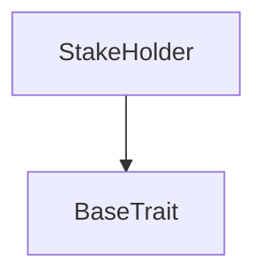
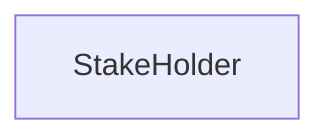

# Tact compilation report

Contract: StakeHolder
BoC Size: 1646 bytes

## Structures (Structs and Messages)

Total structures: 26

### DataSize

TL-B: `_ cells:int257 bits:int257 refs:int257 = DataSize`
Signature: `DataSize{cells:int257,bits:int257,refs:int257}`

### SignedBundle

TL-B: `_ signature:fixed_bytes64 signedData:remainder<slice> = SignedBundle`
Signature: `SignedBundle{signature:fixed_bytes64,signedData:remainder<slice>}`

### StateInit

TL-B: `_ code:^cell data:^cell = StateInit`
Signature: `StateInit{code:^cell,data:^cell}`

### Context

TL-B: `_ bounceable:bool sender:address value:int257 raw:^slice = Context`
Signature: `Context{bounceable:bool,sender:address,value:int257,raw:^slice}`

### SendParameters

TL-B: `_ mode:int257 body:Maybe ^cell code:Maybe ^cell data:Maybe ^cell value:int257 to:address bounce:bool = SendParameters`
Signature: `SendParameters{mode:int257,body:Maybe ^cell,code:Maybe ^cell,data:Maybe ^cell,value:int257,to:address,bounce:bool}`

### MessageParameters

TL-B: `_ mode:int257 body:Maybe ^cell value:int257 to:address bounce:bool = MessageParameters`
Signature: `MessageParameters{mode:int257,body:Maybe ^cell,value:int257,to:address,bounce:bool}`

### DeployParameters

TL-B: `_ mode:int257 body:Maybe ^cell value:int257 bounce:bool init:StateInit{code:^cell,data:^cell} = DeployParameters`
Signature: `DeployParameters{mode:int257,body:Maybe ^cell,value:int257,bounce:bool,init:StateInit{code:^cell,data:^cell}}`

### StdAddress

TL-B: `_ workchain:int8 address:uint256 = StdAddress`
Signature: `StdAddress{workchain:int8,address:uint256}`

### VarAddress

TL-B: `_ workchain:int32 address:^slice = VarAddress`
Signature: `VarAddress{workchain:int32,address:^slice}`

### BasechainAddress

TL-B: `_ hash:Maybe int257 = BasechainAddress`
Signature: `BasechainAddress{hash:Maybe int257}`

### SetJettonWalletAddress

TL-B: `set_jetton_wallet_address#f87a7045 wallet:address = SetJettonWalletAddress`
Signature: `SetJettonWalletAddress{wallet:address}`

### WithdrawTokensAdmin

TL-B: `withdraw_tokens_admin#b4902429 amount:coins = WithdrawTokensAdmin`
Signature: `WithdrawTokensAdmin{amount:coins}`

### StakePlan

TL-B: `_ pps:uint128 duration:uint32 min_stake:coins = StakePlan`
Signature: `StakePlan{pps:uint128,duration:uint32,min_stake:coins}`

### Stake

TL-B: `_ query_id:uint16 plan_index:uint4 refA:address refB:address = Stake`
Signature: `Stake{query_id:uint16,plan_index:uint4,refA:address,refB:address}`

### StakeNotification

TL-B: `stake_notification#0ed3ebe1 query_id:uint64 holder_address:address = StakeNotification`
Signature: `StakeNotification{query_id:uint64,holder_address:address}`

### Unstake

TL-B: `unstake#82bc9424 query_id:uint64 started_at:uint32 staker:address amount:coins withdrawn:coins plan_index:uint4 = Unstake`
Signature: `Unstake{query_id:uint64,started_at:uint32,staker:address,amount:coins,withdrawn:coins,plan_index:uint4}`

### UnstakeOk

TL-B: `unstake_ok#07166d2b  = UnstakeOk`
Signature: `UnstakeOk{}`

### StakeRejected

TL-B: `stake_rejected#e47b9a8c  = StakeRejected`
Signature: `StakeRejected{}`

### HolderUnstake

TL-B: `holder_unstake#4a1b6a2d  = HolderUnstake`
Signature: `HolderUnstake{}`

### TakeReward

TL-B: `take_reward#30450534 query_id:uint16 stake_id:uint16 stake_amount:coins stake_plan_index:uint4 = TakeReward`
Signature: `TakeReward{query_id:uint16,stake_id:uint16,stake_amount:coins,stake_plan_index:uint4}`

### HolderTakeReward

TL-B: `holder_take_reward#1f4cc29f query_id:uint16 full_reward:coins = HolderTakeReward`
Signature: `HolderTakeReward{query_id:uint16,full_reward:coins}`

### TakeRewardOk

TL-B: `take_reward_ok#a03f712d query_id:uint16 stake_id:uint16 staker:address amount:coins reward:coins plan_index:uint4 = TakeRewardOk`
Signature: `TakeRewardOk{query_id:uint16,stake_id:uint16,staker:address,amount:coins,reward:coins,plan_index:uint4}`

### StakeProofRequest

TL-B: `stake_proof_request#4b60157c reward:coins = StakeProofRequest`
Signature: `StakeProofRequest{reward:coins}`

### StakeProof

TL-B: `stake_proof#f1ca386c id:int257 staker:address amount:int257 plan_index:uint4 reward:coins = StakeProof`
Signature: `StakeProof{id:int257,staker:address,amount:int257,plan_index:uint4,reward:coins}`

### Withdraw

TL-B: `withdraw#aa3e544e amount:coins recipient:address = Withdraw`
Signature: `Withdraw{amount:coins,recipient:address}`

### StakeHolder$Data

TL-B: `_ started_at:uint32 finish_at:uint32 id:uint16 master:address staker:address amount:coins withdrawn:coins plan:uint4 holding:bool = StakeHolder`
Signature: `StakeHolder{started_at:uint32,finish_at:uint32,id:uint16,master:address,staker:address,amount:coins,withdrawn:coins,plan:uint4,holding:bool}`

## Get methods

Total get methods: 7

## plan

No arguments

## started_at

No arguments

## finish_at

No arguments

## amount

No arguments

## withdrawn

No arguments

## is_holding

No arguments

## id

No arguments

## Exit codes

- 2: Stack underflow
- 3: Stack overflow
- 4: Integer overflow
- 5: Integer out of expected range
- 6: Invalid opcode
- 7: Type check error
- 8: Cell overflow
- 9: Cell underflow
- 10: Dictionary error
- 11: 'Unknown' error
- 12: Fatal error
- 13: Out of gas error
- 14: Virtualization error
- 32: Action list is invalid
- 33: Action list is too long
- 34: Action is invalid or not supported
- 35: Invalid source address in outbound message
- 36: Invalid destination address in outbound message
- 37: Not enough Toncoin
- 38: Not enough extra currencies
- 39: Outbound message does not fit into a cell after rewriting
- 40: Cannot process a message
- 41: Library reference is null
- 42: Library change action error
- 43: Exceeded maximum number of cells in the library or the maximum depth of the Merkle tree
- 50: Account state size exceeded limits
- 128: Null reference exception
- 129: Invalid serialization prefix
- 130: Invalid incoming message
- 131: Constraints error
- 132: Access denied
- 133: Contract stopped
- 134: Invalid argument
- 135: Code of a contract was not found
- 136: Invalid standard address
- 138: Not a basechain address
- 11184: Not a master
- 17470: Already unstaked
- 25558: Not a staker
- 31749: No need to take reward only, unstake
- 36101: Too early to unstake
- 38505: No reward to withdraw

## Trait inheritance diagram

## Contract dependency diagram

