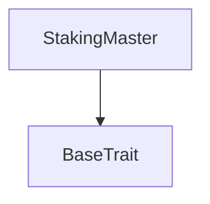
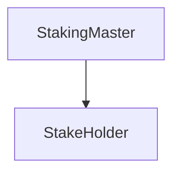

# Tact compilation report

Contract: StakingMaster
BoC Size: 5978 bytes

## Structures (Structs and Messages)

Total structures: 38

### DataSize

TL-B: `_ cells:int257 bits:int257 refs:int257 = DataSize`
Signature: `DataSize{cells:int257,bits:int257,refs:int257}`

### SignedBundle

TL-B: `_ signature:fixed_bytes64 signedData:remainder<slice> = SignedBundle`
Signature: `SignedBundle{signature:fixed_bytes64,signedData:remainder<slice>}`

### StateInit

TL-B: `_ code:^cell data:^cell = StateInit`
Signature: `StateInit{code:^cell,data:^cell}`

### Context

TL-B: `_ bounceable:bool sender:address value:int257 raw:^slice = Context`
Signature: `Context{bounceable:bool,sender:address,value:int257,raw:^slice}`

### SendParameters

TL-B: `_ mode:int257 body:Maybe ^cell code:Maybe ^cell data:Maybe ^cell value:int257 to:address bounce:bool = SendParameters`
Signature: `SendParameters{mode:int257,body:Maybe ^cell,code:Maybe ^cell,data:Maybe ^cell,value:int257,to:address,bounce:bool}`

### MessageParameters

TL-B: `_ mode:int257 body:Maybe ^cell value:int257 to:address bounce:bool = MessageParameters`
Signature: `MessageParameters{mode:int257,body:Maybe ^cell,value:int257,to:address,bounce:bool}`

### DeployParameters

TL-B: `_ mode:int257 body:Maybe ^cell value:int257 bounce:bool init:StateInit{code:^cell,data:^cell} = DeployParameters`
Signature: `DeployParameters{mode:int257,body:Maybe ^cell,value:int257,bounce:bool,init:StateInit{code:^cell,data:^cell}}`

### StdAddress

TL-B: `_ workchain:int8 address:uint256 = StdAddress`
Signature: `StdAddress{workchain:int8,address:uint256}`

### VarAddress

TL-B: `_ workchain:int32 address:^slice = VarAddress`
Signature: `VarAddress{workchain:int32,address:^slice}`

### BasechainAddress

TL-B: `_ hash:Maybe int257 = BasechainAddress`
Signature: `BasechainAddress{hash:Maybe int257}`

### JettonData

TL-B: `_ total_supply:int257 mintable:bool owner:address content:^cell wallet_code:^cell = JettonData`
Signature: `JettonData{total_supply:int257,mintable:bool,owner:address,content:^cell,wallet_code:^cell}`

### JettonWalletData

TL-B: `_ balance:int257 owner:address master:address code:^cell = JettonWalletData`
Signature: `JettonWalletData{balance:int257,owner:address,master:address,code:^cell}`

### TokenTransfer

TL-B: `token_transfer#0f8a7ea5 query_id:uint64 amount:coins receiver:address response_destination:address custom_payload:Maybe ^cell forward_ton_amount:coins forward_payload:remainder<slice> = TokenTransfer`
Signature: `TokenTransfer{query_id:uint64,amount:coins,receiver:address,response_destination:address,custom_payload:Maybe ^cell,forward_ton_amount:coins,forward_payload:remainder<slice>}`

### TokenTransferInternal

TL-B: `token_transfer_internal#178d4519 query_id:uint64 amount:coins from:address response_destination:address forward_ton_amount:coins forward_payload:remainder<slice> = TokenTransferInternal`
Signature: `TokenTransferInternal{query_id:uint64,amount:coins,from:address,response_destination:address,forward_ton_amount:coins,forward_payload:remainder<slice>}`

### TokenNotification

TL-B: `token_notification#7362d09c query_id:uint64 amount:coins from:address forward_payload:remainder<slice> = TokenNotification`
Signature: `TokenNotification{query_id:uint64,amount:coins,from:address,forward_payload:remainder<slice>}`

### TokenBurn

TL-B: `token_burn#595f07bc query_id:uint64 amount:coins response_destination:address custom_payload:Maybe ^cell = TokenBurn`
Signature: `TokenBurn{query_id:uint64,amount:coins,response_destination:address,custom_payload:Maybe ^cell}`

### TokenBurnNotification

TL-B: `token_burn_notification#7bdd97de query_id:uint64 amount:coins sender:address response_destination:address = TokenBurnNotification`
Signature: `TokenBurnNotification{query_id:uint64,amount:coins,sender:address,response_destination:address}`

### TokenExcesses

TL-B: `token_excesses#d53276db query_id:uint64 = TokenExcesses`
Signature: `TokenExcesses{query_id:uint64}`

### TokenUpdateContent

TL-B: `token_update_content#af1ca26a content:^cell = TokenUpdateContent`
Signature: `TokenUpdateContent{content:^cell}`

### ProvideWalletAddress

TL-B: `provide_wallet_address#2c76b973 query_id:uint64 owner_address:address include_address:bool = ProvideWalletAddress`
Signature: `ProvideWalletAddress{query_id:uint64,owner_address:address,include_address:bool}`

### TakeWalletAddress

TL-B: `take_wallet_address#d1735400 query_id:uint64 wallet_address:address owner_address:remainder<slice> = TakeWalletAddress`
Signature: `TakeWalletAddress{query_id:uint64,wallet_address:address,owner_address:remainder<slice>}`

### SetJettonWalletAddress

TL-B: `set_jetton_wallet_address#f87a7045 wallet:address = SetJettonWalletAddress`
Signature: `SetJettonWalletAddress{wallet:address}`

### WithdrawTokensAdmin

TL-B: `withdraw_tokens_admin#b4902429 amount:coins = WithdrawTokensAdmin`
Signature: `WithdrawTokensAdmin{amount:coins}`

### StakePlan

TL-B: `_ pps:uint128 duration:uint32 min_stake:coins = StakePlan`
Signature: `StakePlan{pps:uint128,duration:uint32,min_stake:coins}`

### Stake

TL-B: `_ query_id:uint16 plan_index:uint4 refA:address refB:address = Stake`
Signature: `Stake{query_id:uint16,plan_index:uint4,refA:address,refB:address}`

### StakeNotification

TL-B: `stake_notification#0ed3ebe1 query_id:uint64 holder_address:address = StakeNotification`
Signature: `StakeNotification{query_id:uint64,holder_address:address}`

### Unstake

TL-B: `unstake#82bc9424 query_id:uint64 started_at:uint32 staker:address amount:coins withdrawn:coins plan_index:uint4 = Unstake`
Signature: `Unstake{query_id:uint64,started_at:uint32,staker:address,amount:coins,withdrawn:coins,plan_index:uint4}`

### UnstakeOk

TL-B: `unstake_ok#07166d2b  = UnstakeOk`
Signature: `UnstakeOk{}`

### StakeRejected

TL-B: `stake_rejected#e47b9a8c  = StakeRejected`
Signature: `StakeRejected{}`

### HolderUnstake

TL-B: `holder_unstake#4a1b6a2d  = HolderUnstake`
Signature: `HolderUnstake{}`

### TakeReward

TL-B: `take_reward#30450534 query_id:uint16 stake_id:uint16 stake_amount:coins stake_plan_index:uint4 = TakeReward`
Signature: `TakeReward{query_id:uint16,stake_id:uint16,stake_amount:coins,stake_plan_index:uint4}`

### HolderTakeReward

TL-B: `holder_take_reward#1f4cc29f query_id:uint16 full_reward:coins = HolderTakeReward`
Signature: `HolderTakeReward{query_id:uint16,full_reward:coins}`

### TakeRewardOk

TL-B: `take_reward_ok#a03f712d query_id:uint16 stake_id:uint16 staker:address amount:coins reward:coins plan_index:uint4 = TakeRewardOk`
Signature: `TakeRewardOk{query_id:uint16,stake_id:uint16,staker:address,amount:coins,reward:coins,plan_index:uint4}`

### StakeProofRequest

TL-B: `stake_proof_request#4b60157c reward:coins = StakeProofRequest`
Signature: `StakeProofRequest{reward:coins}`

### StakeProof

TL-B: `stake_proof#f1ca386c id:int257 staker:address amount:int257 plan_index:uint4 reward:coins = StakeProof`
Signature: `StakeProof{id:int257,staker:address,amount:int257,plan_index:uint4,reward:coins}`

### Withdraw

TL-B: `withdraw#aa3e544e amount:coins recipient:address = Withdraw`
Signature: `Withdraw{amount:coins,recipient:address}`

### StakeHolder$Data

TL-B: `_ started_at:uint32 finish_at:uint32 id:uint16 master:address staker:address amount:coins withdrawn:coins plan:uint4 holding:bool = StakeHolder`
Signature: `StakeHolder{started_at:uint32,finish_at:uint32,id:uint16,master:address,staker:address,amount:coins,withdrawn:coins,plan:uint4,holding:bool}`

### StakingMaster$Data

TL-B: `_ id:uint32 plans:dict<uint4, ^StakePlan{pps:uint128,duration:uint32,min_stake:coins}> admin:address jetton_wallet:address total_balance:uint256 locked_value:uint256 = StakingMaster`
Signature: `StakingMaster{id:uint32,plans:dict<uint4, ^StakePlan{pps:uint128,duration:uint32,min_stake:coins}>,admin:address,jetton_wallet:address,total_balance:uint256,locked_value:uint256}`

## Get methods

Total get methods: 9

## plans

No arguments

## admin

No arguments

## jetton_wallet

No arguments

## total_balance

No arguments

## locked_value

No arguments

## calculate_reward

Argument: amount
Argument: plan_index

## can_take_stake

Argument: amount
Argument: plan_index
Argument: refStakeA
Argument: refStakeB

## free_tokens

No arguments

## staking_address

Argument: id
Argument: staker
Argument: amount
Argument: plan_index

## Exit codes

- 2: Stack underflow
- 3: Stack overflow
- 4: Integer overflow
- 5: Integer out of expected range
- 6: Invalid opcode
- 7: Type check error
- 8: Cell overflow
- 9: Cell underflow
- 10: Dictionary error
- 11: 'Unknown' error
- 12: Fatal error
- 13: Out of gas error
- 14: Virtualization error
- 32: Action list is invalid
- 33: Action list is too long
- 34: Action is invalid or not supported
- 35: Invalid source address in outbound message
- 36: Invalid destination address in outbound message
- 37: Not enough Toncoin
- 38: Not enough extra currencies
- 39: Outbound message does not fit into a cell after rewriting
- 40: Cannot process a message
- 41: Library reference is null
- 42: Library change action error
- 43: Exceeded maximum number of cells in the library or the maximum depth of the Merkle tree
- 50: Account state size exceeded limits
- 128: Null reference exception
- 129: Invalid serialization prefix
- 130: Invalid incoming message
- 131: Constraints error
- 132: Access denied
- 133: Contract stopped
- 134: Invalid argument
- 135: Code of a contract was not found
- 136: Invalid standard address
- 138: Not a basechain address
- 3980: Not enough jettons to payout
- 11184: Not a master
- 14434: No such plan
- 17470: Already unstaked
- 25558: Not a staker
- 31749: No need to take reward only, unstake
- 32683: Not enough value for fees
- 36101: Too early to unstake
- 38505: No reward to withdraw
- 44179: Not a holder
- 45135: Not my jetton wallet
- 45786: Not an admin
- 52251: Plan not exist
- 55100: Not enough free balance
- 61639: Not enough jettons to payout wtf

## Trait inheritance diagram

## Contract dependency diagram

